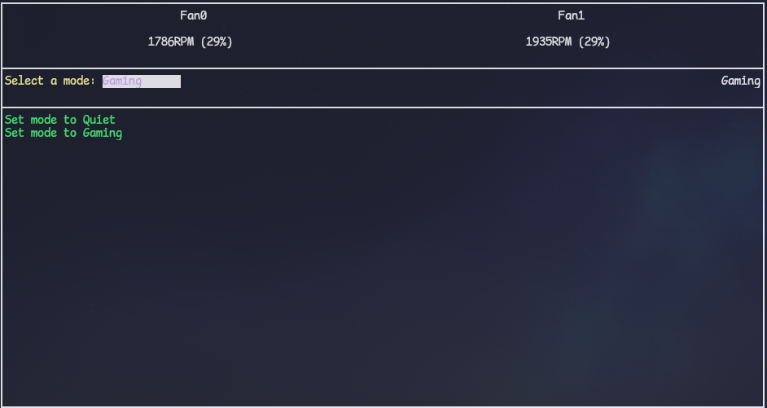

# AorusControl
A TUI to control your Aorus Motherboard / Laptop Fan settings.

## Features
- Monitor current fan speeds
- See current fan mode
- Set fan speed

## Screenshot


## Installation
```bash
go install github.com/simulatan/aoruscontrol@main
```
